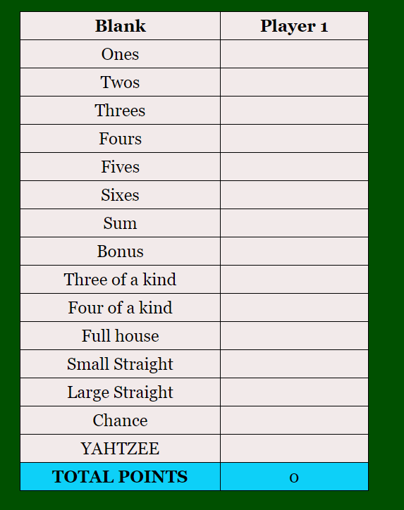
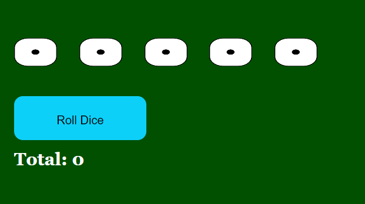

# Vishnu Malkapuram's Yatzy Game Design Documentation:

The Yatzy game's design system is thoughtfully crafted and clearly documented to ensure a cohesive and visually appealing user experience. It is communicated through the effective use of colors, typography, components, layouts, and supported by illustrative mock-ups.

## **1. Color Palette:**
The choice of a dark green background for the game is a strategic and visually appealing decision. It creates a distinct ambiance that resonates with the classic and sophisticated style often associated with casino games, like poker.
- **Primary Text Color:**`#000000`
- **Text Color in header:** `#fff00` & `#ffa500`
- **Text Color in the body:** `#000000`
- **Background Color for the body:** `#005000`
- **Table color:** `#f2eaea`

## **2. Typography**
- **Body Text:** `Georgia, 'Times New Roman', Times, serif`
- **Header text :** `'Bungee Spice` (Extracted this font from google fonts using the import keyword.)

## **3. Components and Layout**
### Header
- **Design:** There is no header design but just a heading with the game name in a stylish font.
- **Mock-up Screenshot:**

### Scorecard
- **Design:** The scorecard is a straightforward and organized table, using a clean and unobtrusive background color of #f2eaea. To make it easy for players to identify the total points they've scored, the last row of the table is thoughtfully highlighted in a different color, #0dd0f8. The scorecard is placed on the right side of the web page.
- **Mock-up Screenshot:**

### Play Area
- **Design:** The design of the play area is a key aspect of the game's visual identity and user experience. The use of a dark green background (#005000) for this area is a deliberate and aesthetically pleasing choice. The play area is placed on the left side of the web page.
- **Mock-up Screenshot:**

## **4. Dice Design**
The design of the dice, represented by the "dice2.png" image, is achieved using CSS.The line - "background-size: 600% 100%;" specifies how the background image is scaled within the dice element. In this case, the image is scaled to 600% of its original width while maintaining its original height, which may create a stretching effect.

## **5. Game Rules**
**Upper Section:**
- **Ones:** The sum of all dice showing the number 1.
- **Twos:** The sum of all dice showing the number 2.
- **Threes:** The sum of all dice showing the number 3.
- **Fours:** The sum of all dice showing the number 4.
- **Fives:** The sum of all dice showing the number 5.
- **Sixes:** The sum of all dice showing the number 6.
If a player manages to score at least 63 points (an average of three of each number) in the upper section, they are awarded a bonus of 50 points.

**Lower Section:**

- **One Pair:** Two dice showing the same number. Score: Sum of those two dice.
- **Two Pairs:** Two different pairs of dice. Score: Sum of dice in those two pairs.
- **Three of a Kind:** Three dice showing the same number. Score: Sum of those three dice.
- **Four of a Kind:** Four dice with the same number. Score: Sum of those four dice.
- **Small Straight:** The combination 1-2-3-4-5. Score: 15 points (sum of all the dice).
- **Large Straight:** The combination 2-3-4-5-6. Score: 20 points (sum of all the dice).
- **Full House:** Any set of three combined with a different pair. Score: Sum of all the dice.
- **Chance:** Any combination of dice. Score: Sum of all the dice.
- **Yatzy:** All five dice with the same number. Score: 50 points.

## **Conclusion**
This design documentation serves as a comprehensive and informative guide to the foundational elements and decisions behind the Yatzy game project's visual design. By establishing a well-defined design system, we have created a visually appealing and unified user experience. The consistent use of a dark green color palette not only lends an attractive aesthetic but also infuses a touch of sophistication, reminiscent of classic casino games.

